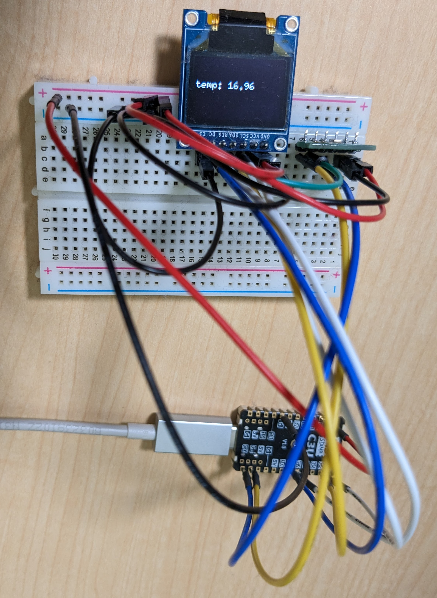

# インターフェース2023年5月号ソースコード

[インターフェース2023年5月号](https://interface.cqpub.co.jp/magazine/202305/) マイコンで動くフル機能Rustのソースコードリポジトリです。
質問や困ったことがあれば [issues](https://github.com/tomoyuki-nakabayashi/interface202305-c3-std-rust/issues) にお願いします。

[M5Stamp C3U Mate](https://www.switch-science.com/products/7894) で **std** を使えった組込み Rust を体験しましょう。
最終的なアプリケーションは `HTTP client` と `HTTP server` とに別れ、それぞれ次の機能を持ちます。
- HTTP client
  - タイマーを使って定期的にセンサー値を読み出す
  - ボタン割り込みで読み取ったセンサー値のうち、server に POST するものを切り替える
- HTTP server
  - client から受け取ったセンサー値をディスプレイ表示に表示する

HTTP client / HTTP server ともに複数のスレッドを用いて機能を実現しています。
そのため、Rust の並行性に対する安全性を体験することができます。

## 必要機材

今回利用する機材は次の通りです。

- [M5Stamp C3U Mate](https://www.switch-science.com/products/7894) x 1 または 2[^1]
- USB-Cケーブル x 1 または 2
- [BME280温湿度気圧センサモジュール](https://akizukidenshi.com/catalog/g/gK-09421/) x 1
- [SSD1331有機ELディスプレイ](https://akizukidenshi.com/catalog/g/gP-14435/) x 1
- M5Stamp C3U Mateとセンサ、ディスプレイを接続する機材
  - ブレッドボード x 1
  - ジャンパワイヤ15本ほど

[^1]:2台あると最後のサンプルアプリケーション作成時、HTTPクライアントで1台、HTTPサーバーで1台の構成で動作させることが可能です。1台でHTTPクライアントとHTTPサーバーを兼ねるコードも用意しています。

M5Stamp C3U Mateとセンサ、ディスプレイを接続するために、今回著者は[スルーホール用テストワイヤ](https://www.switch-science.com/products/5382)を使用しています。
ある程度、組込みRustの経験がある方であれば、センサモジュールとディスプレイは別のものを利用してもかまいません。

# English

This is the source code repository of "full-feature Rust on a microcontroller" published in [Interface 202305](https://interface.cqpub.co.jp/magazine/202305/). (`Interface` is a magazine for embedded system engineers in Japanese)
If you have questions or troubles, feel free to create new [issues](https://github.com/tomoyuki-nakabayashi/interface202305-c3-std-rust/issues).

Play embedded Rust with **std** on [M5Stamp C3U Mate](https://www.switch-science.com/products/7894).
The final application will be split into an `HTTP client` and an `HTTP server`, each with the following features
- HTTP client
  - Read sensor values periodically using a timer.
  - Switch type of sensor value POST to the server by button interrupt.
- HTTP server
  - Displays the sensor values received from the client on the display.

Both HTTP client and HTTP server use multiple threads to perform their functions.
We can experience the concurrency safety of Rust.

## Required hardware

The hardware to be used for this project is as follows

- [M5Stamp C3U Mate](https://www.switch-science.com/products/7894) x 1 or 2[^2]
- USB-C cable x 1 or 2
- [BME280 temperature, humidity, and barometric pressure sensor module](https://akizukidenshi.com/catalog/g/gK-09421/) x 1
- [SSD1331 OLED Display](https://akizukidenshi.com/catalog/g/gP-14435/) x 1
- Equipment to connect M5Stamp C3U Mate to the sensor and display
  - Breadboard x 1
  - About 15 jumper wires

[^2]:If you have two units, you can run one unit as HTTP client and one unit as HTTP server when you create the last application.

To connect the M5Stamp C3U Mate to the sensor and display, the author has used [Test Wire for Through Hole](https://www.switch-science.com/products/5382).
If you have some experience with embedded Rust, you may use a different sensor module and display.

# License

Licensed under either of

- Apache License, Version 2.0 ([LICENSE-APACHE](LICENSE-APACHE) or
  http://www.apache.org/licenses/LICENSE-2.0)

- MIT license ([LICENSE-MIT](LICENSE-MIT) or http://opensource.org/licenses/MIT)

at your option.
